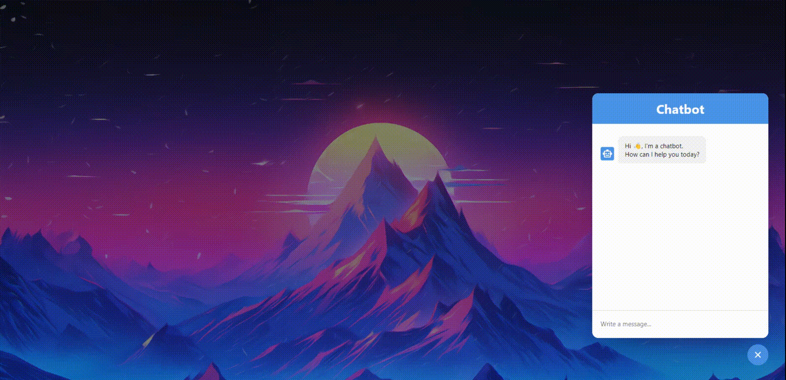

# Chatbot-web
### Working chatbot in html using GPT 3.5 API

# Using
### 1. Go to [OpenAI platform API](https://platform.openai.com/api-keys) to get API.
### 2. Create `api_url.js` like this:
  
<code>
const API_URL = "https://api.openai.com/v1/chat/completions";  
const API_KEY = "Your token here";  
export { API_URL, API_KEY };
</code>  

### 3. Deploy your web.

# Demo

